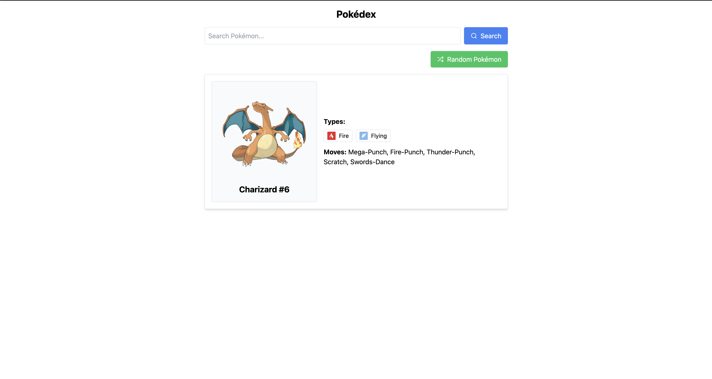
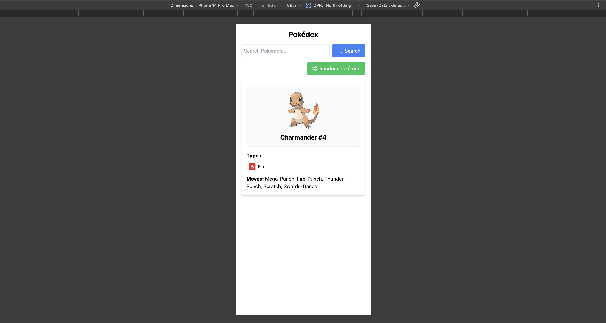

# Pokédex

A responsive Pokédex built with React, TypeScript, Vite, Tailwind CSS, and the [PokeAPI](https://pokeapi.co/). The app supports random Pokemon discovery, searchable Pokemon lookup, keyboard-friendly autocomplete, local type icons, responsive cards, and a small unit test suite.

## Screenshots

### Desktop



### Mobile



## Deployment
Deployment using Netlify. Find the application [here](https://pistachio-pokedex.netlify.app/)

## Features

- Search Pokémon by name using data from the PokeAPI Pokémon list endpoint.
- Autocomplete suggestions update as the user types.
- Keyboard navigation for suggestions with `ArrowUp`, `ArrowDown`, `Enter`, and `Escape`.
- Clear button inside the search input.
- Random Pokémon button for first-generation Pokémon IDs `1` through `151`.
- Official artwork display with fallback to the default sprite.
- Local Pokémon type icon assets under `public/type-icons`, avoiding extra type-icon requests per Pokémon.
- Responsive Pokémon card layout:
  - desktop: image/name block beside details
  - mobile: stacked image/name and details
- Loading spinner component for Pokémon detail fetches.
- Unit tests for API mapping, card rendering, and search behavior.

## Tech Stack

- React 19
- TypeScript
- Vite
- Tailwind CSS
- Lucide React icons
- Vitest
- React Testing Library
- PokeAPI

## Getting Started

Install dependencies:

```bash
npm install
```

Start the local dev server:

```bash
npm run dev
```

Open the local URL printed by Vite, usually:

```text
http://localhost:5173/
```

## Available Scripts

```bash
npm run dev
```

Starts the Vite dev server.

```bash
npm run build
```

Runs TypeScript build checks and creates a production build.

```bash
npm run test
```

Runs the unit test suite with Vitest.

```bash
npm run lint
```

Runs ESLint.

```bash
npm run preview
```

Serves the production build locally.

## Project Structure

```text
.
├── docs/
│   └── screenshots/
│       ├── desktop.png
│       └── mobile.png
├── public/
│   └── type-icons/
├── src/
│   ├── api/
│   │   └── pokemonApi.ts
│   ├── components/
│   │   ├── Loader.tsx
│   │   ├── PokemonCard.tsx
│   │   └── SearchBar.tsx
│   ├── hooks/
│   │   └── usePokemon.ts
│   ├── types/
│   │   └── pokemon.ts
│   ├── utilities/
│   │   ├── icons.ts
│   │   └── urls.ts
│   ├── App.tsx
│   ├── index.css
│   └── main.tsx
├── tests/
│   ├── api/
│   ├── components/
│   └── setupTests.ts
└── vite.config.ts
```

## Implementation Notes

The app keeps API concerns in `src/api/pokemonApi.ts`, shared state in `src/hooks/usePokemon.ts`, and display logic in components. Pokémon type icon URLs are resolved to local static files so searching different Pokémon does not trigger repeated type-icon API calls.

Search suggestions are filtered locally after the Pokémon name list is loaded. This keeps typing responsive and avoids firing a Pokémon detail request on every keystroke. The detail fetch happens when the user submits the search, clicks a suggestion, or selects one with the keyboard.

The UI uses Tailwind utility classes directly in components. Lucide React provides the search and shuffle icons.

## Testing

Tests live outside the app source in the `tests` folder.

Current coverage includes:

- PokeAPI response mapping
- Pokémon name list parsing
- Pokémon card rendering
- Autocomplete filtering
- Keyboard selection in the search dropdown

Run tests with:

```bash
npm run test
```

## Project Guidelines

- Keep API mapping, state management, and UI rendering separate.
- Prefer typed response shapes for data read from external APIs.
- Avoid duplicating derived state; compute simple derived values from existing state or props.
- Keep network calls intentional:
  - fetch the Pokémon name list once
  - fetch Pokémon details only on explicit user action
  - serve type icons locally
- Keep components small and focused.
- Add tests for behavior, not implementation details.
- Use accessible controls for interactive UI:
  - real buttons for actions
  - keyboard support for autocomplete
  - meaningful `aria-label` values where visible text is absent
- Preserve responsive behavior when changing layout.


## Future Improvements

- Add stricter TypeScript interfaces for the exact PokeAPI response fields used by the app.
- Limit displayed autocomplete results for very broad queries.
- Add loading and disabled states to the Search and Random Pokémon buttons.
- Add an error alert component instead of plain error text.
- Add a CI workflow that runs lint, tests, and build on every pull request.
